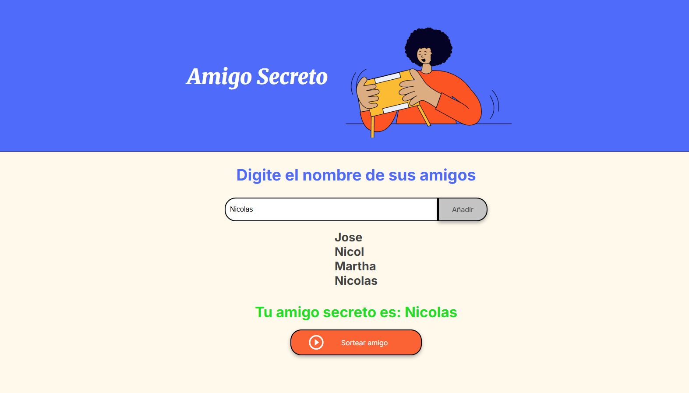

# ALura-ONE Reto 1: Amigo Secreto

## Descripción del Proyecto
Este proyecto, titulado **"Amigo Secreto"**, es parte de **ALura-ONE Reto 1**. Está diseñado específicamente para principiantes que quieren aprender y aplicar sus primeros conocimientos en desarrollo web utilizando tecnologías fundamentales como **HTML**, **CSS** y **JavaScript**.

## Objetivo del Proyecto
El reto consiste en crear una página web interactiva en la que los usuarios puedan participar en el tradicional juego del "Amigo Secreto". En este proyecto, aprenderemos a estructurar una página web básica, aplicar estilos para hacerla visualmente atractiva, y agregar interactividad para que los usuarios puedan disfrutar del juego.

Este proyecto es ideal para aquellos que estén comenzando en el mundo del desarrollo web, ya que permite explorar de manera práctica y divertida las bases del desarrollo web.

## Imagen del Proyecto

## Autor
**[Nicolas David Peñuela Arango]**  
Este proyecto fue desarrollado como parte del reto de ALura-ONE.  
Si tienes alguna pregunta o sugerencia, no dudes en contactar conmigo.